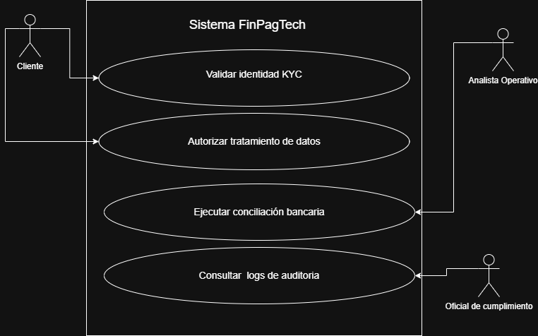

### Especificación de Requerimientos Funcionales - FinPagTech

| Requerimiento Funcional N° | Nombre |
| :--- | :--- |
| **RF01** | **Automatización de Conciliación Bancaria y Financiera** |
| **Descripción:** | El sistema debe realizar la validación automática y en tiempo real de las transacciones procesadas contra los extractos bancarios, identificando discrepancias sin intervención manual. El módulo deberá generar alertas inmediatas ante inconsistencias y producir reportes de cierre diario para eliminar el margen de error del 15% actual. |

---

| Requerimiento Funcional N° | Nombre |
| :--- | :--- |
| **RF02** | **Sistema de Verificación de Identidad Digital (KYC)** |
| **Descripción:** | El sistema debe validar automáticamente la identidad de los nuevos usuarios mediante el escaneo de su cédula y reconocimiento facial. También debe verificar antecedentes en listas legales al instante y guardar un comprobante de que el proceso se realizó correctamente para evitar multas. |

---

| Requerimiento Funcional N° | Nombre |
| :--- | :--- |
| **RF03** | **Gestión de Consentimiento de Datos (Ley 1581)** |
| **Descripción:** | El sistema debe permitir al usuario otorgar su autorización expresa para el tratamiento de datos personales (biometría y cédula) antes de iniciar cualquier proceso. El software debe almacenar el registro digital de dicha autorización de forma segura y consultable para cumplir con la normativa vigente. |

---

| Requerimiento Funcional N° | Nombre |
| :--- | :--- |
| **RF04** | **Control de Acceso y Registro de Auditoría** |
| **Descripción:** | El sistema debe restringir el acceso a la información sensible basándose en perfiles de usuario autorizados. Cada vez que un funcionario consulte o modifique datos de usuarios, el sistema debe generar un registro (log) automático e inalterable que detalle fecha, hora, usuario y acción realizada para prevenir fugas de información. |

