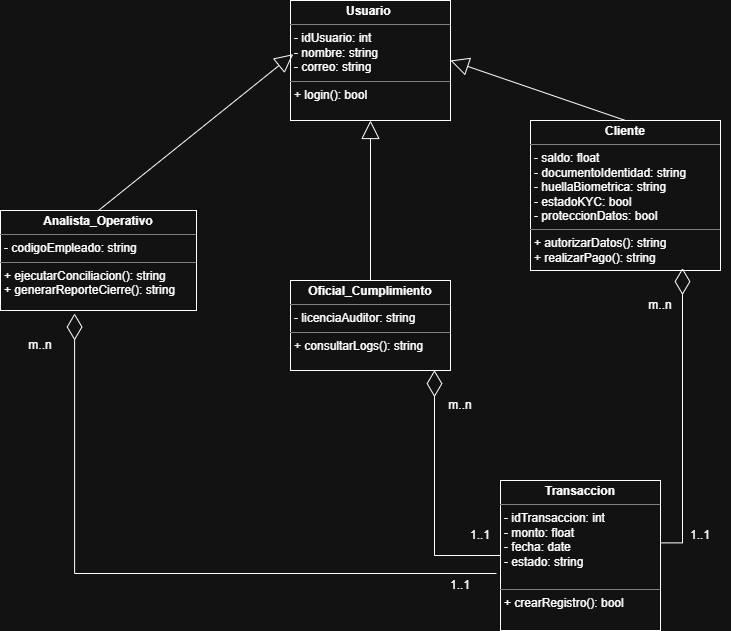

## Explicación del Diagrama de Clases - Sistema FinPagTech

El diagrama de clases para **FinPagTech** ha sido estructurado bajo el estándar UML para resolver las deficiencias en seguridad, cumplimiento legal y eficiencia operativa identificadas en el caso de estudio.

### 1. Arquitectura de Herencia (Generalización)
Se implementó una estructura de herencia donde la clase **Usuario** actúa como la superclase. Las clases **Analista_Operativo**, **Oficial_Cumplimiento** y **Cliente** heredan de ella, compartiendo atributos base (`idUsuario`, `nombre`, `correo`) y el método de autenticación `login(): bool`. Esto garantiza un control de acceso unificado y escalable para los 50,000 usuarios proyectados.

### 2. Relaciones de Composición y Multiplicidad
El diagrama establece relaciones de **Composición** (representadas por rombos) entre los roles operativos y la entidad core del negocio, la clase **Transaccion**:
* **Cliente - Transaccion:** Relación de composición con multiplicidad `1..1` a `m..n`, indicando que las transacciones dependen directamente de la existencia de un cliente responsable.
* **Analista y Oficial - Transaccion:** El sistema vincula a los actores de control con las transacciones bajo la misma lógica de composición, permitiendo que el **Analista** ejecute la conciliación y el **Oficial** realice auditorías de integridad.

### 3. Soluciones a la Crisis Operativa y Legal
* **Automatización Financiera:** El método `ejecutarConciliacion(): string` en la clase `Analista_Operativo` permite procesar el flujo de datos de la clase `Transaccion`, eliminando el error manual del 15%.
* **Cumplimiento KYC y Ley 1581:** La clase `Cliente` integra los atributos críticos `estadoKYC: bool` y `proteccionDatos: bool`. Estos campos aseguran que el sistema valide la identidad y el consentimiento legal antes de invocar el método `realizarPago()`, evitando multas regulatorias y fugas de información.

### 4. Integridad de Procesos
Se corrigió el método `crearRegistro()` en la clase **Transaccion** para que retorne un tipo `bool`, asegurando que el sistema reciba una confirmación lógica de éxito o fallo tras cada operación financiera.

