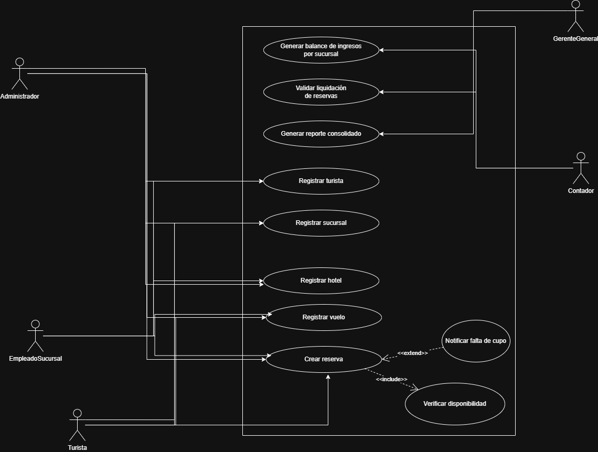

# Entregable 1: Diagrama de Casos de Uso - Agencia de Viajes

## 1. Identificación de Actores
[cite_start]Para garantizar la centralización de la información y la trazabilidad financiera, se han definido los siguientes actores[cite: 52]:
* [cite_start]**Administrador:** Gestiona el inventario global de sucursales, hoteles y vuelos[cite: 54].
* [cite_start]**Empleado de Sucursal:** Realiza la atención directa y el registro de reservas[cite: 55].
* [cite_start]**Turista:** Proporciona sus datos y solicita los servicios de viaje[cite: 57].
* **Contador:** Supervisa la liquidación de reservas y el balance de ingresos por sede.
* **Gerente General:** Consulta reportes consolidados para la toma de decisiones estratégicas.

## 2. Especificación de Casos de Uso
[cite_start]El sistema cuenta con los siguientes casos de uso principales para resolver la duplicidad y falta de reportes[cite: 58]:

1. [cite_start]**Registrar Turista:** Captura estructurada de datos del cliente[cite: 33].
2. [cite_start]**Gestionar Sucursal:** Registro y actualización de sedes físicas[cite: 21].
3. [cite_start]**Registrar Hotel/Vuelo:** Carga de inventario de plazas disponibles[cite: 25, 29].
4. [cite_start]**Consultar Disponibilidad:** Verificación en tiempo real de cupos[cite: 26, 30].
5. [cite_start]**Crear Reserva:** Vinculación de un turista con un servicio en una sucursal[cite: 36, 37].
6. [cite_start]**Cancelar Reserva:** Liberación automática de plazas ocupadas[cite: 40].
7. **Generar Balance de Ingresos:** Consolidación financiera realizada por el Contador.
8. **Generar Reporte Consolidado:** Vista global de la operación para la Gerencia.

## 3. Relaciones Especiales (UML)

### 3.1 Relación <<include>> (Inclusión)
* **Origen:** Crear Reserva.
* **Destino:** Validar Disponibilidad.
* [cite_start]**Justificación:** Es obligatorio validar que existan plazas antes de confirmar cualquier reserva[cite: 39]. [cite_start]Esta relación elimina el error de disponibilidad de plazas mencionado en el diagnóstico inicial[cite: 6, 61].

### 3.2 Relación <<extend>> (Extensión)
* **Origen:** Notificar Falta de Cupo.
* **Destino:** Crear Reserva.
* [cite_start]**Justificación:** Esta funcionalidad solo se ejecuta si la validación de disponibilidad resulta negativa. Es un flujo excepcional que informa al empleado que no se puede proceder con la venta.

## 4. Diagrama Visual

