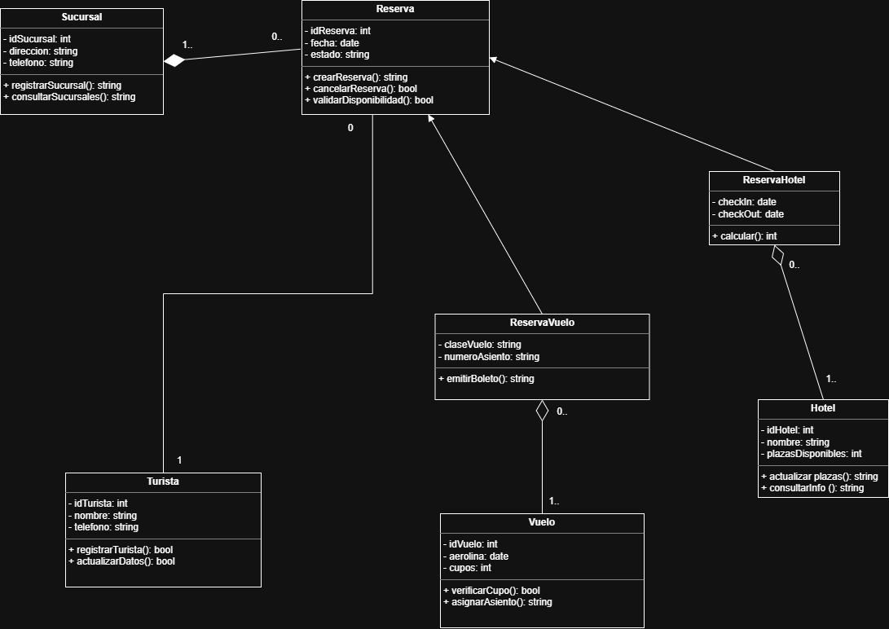

# Entregable 2: Diagrama de Clases - Sistema de Reservas

## 1. Arquitectura de Clases y Encapsulamiento
.El sistema se ha diseñado bajo el paradigma de Programación Orientada a Objetos, asegurando que todos los atributos sean privados (`-`) y el acceso se realice mediante métodos públicos (`+`)

### Clases Principales (Estructura de Datos)
* .**Sucursal:** Clase central que gestiona la ubicación y el contacto de cada sede
* .**Turista:** Almacena la información personal de los clientes para evitar la pérdida de datos
* .**Reserva (Clase Base):** Contiene la lógica común de fechas, estados y validación de disponibilidad

* .**ReservaHotel / ReservaVuelo:** Especializaciones que heredan de la clase Reserva para manejar servicios específicos
* .**Hotel:** Controla el inventario de plazas de hospedaje
* .**Vuelo:** Controla el inventario de asientos y destinos aéreos

## 2. Definición de Relaciones y Cardinalidad
.Para resolver los problemas de trazabilidad y duplicidad, se han implementado las siguientes relaciones UML

### .A. Composición (Sucursal - Reserva) 
* **Representación:** Rombo negro relleno en el extremo de la clase **Sucursal**.
* **Cardinalidad:** `1` a `0..*`.
* **Justificación:** Una reserva no puede existir sin una sucursal responsable de la contratación. .Si la sucursal se elimina, sus registros de reserva deben ser auditados, garantizando la trazabilidad total solicitada

### .B. Agregación (Servicio - Reserva) 
* **Representación:** Rombo blanco vacío en el extremo de las clases **Hotel** o **Vuelo**.
* **Cardinalidad:** `1` a `1..*`.
* **Justificación:** Los servicios (Hotel/Vuelo) agregan múltiples reservas. .La relación es de agregación ya que los hoteles y vuelos existen independientemente de si tienen reservas activas o no

### C. Asociación (Turista - Reserva)
* **Representación:** Línea sólida simple.
* **Cardinalidad:** `1` a `0..*`.
* .**Justificación:** Vincula al cliente final con sus solicitudes de viaje, resolviendo la desorganización de la información de turistas

## 3. Métodos y Comportamiento (Validaciones de Negocio)
.Cada clase incluye métodos específicos para cumplir con los objetivos del proyecto
* .`validarDisponibilidad()`: Método crítico en la clase Reserva para evitar sobrecupos
* .`actualizarPlazas()`: Métodos en Hotel y Vuelo que modifican el inventario tras una reserva o cancelación

